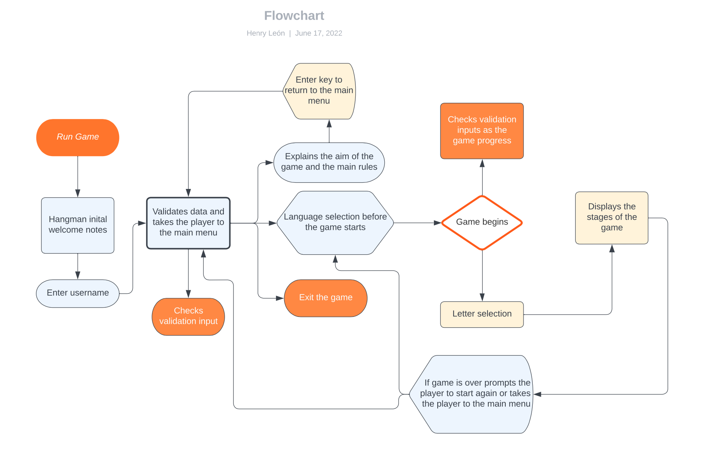

# Project Portfolio 3 Python - Hangman Game

Tradicionally hangman is a guessing game for two or more players. One player thinks of a word, phrase or sentence and the other(s) tries to guess it by suggesting letters within a certain number of guesses. Originally a Paper-and-pencil game, there are now electronic versions.
For more details about the origins of this game please click on the below link:

[Hangman - Wikipedia](https://en.wikipedia.org/wiki/Hangman_(game))

My version of the game allows to play one user at the time, I've implemented a menu that allows players to
chose the word in three different languages, there are a few functions that check the user validation
inputs for the game flow; in this version the player can only guess one letter at the time, if the word content two of the same letters, then they will be displayed on the screen, this increases the chances of winning, if after six attempts the player fails to guess the word, then it's game over.

The main goal of this project is to demonstrate my knowledge acquired throughout the course in Python. 
I hope you all like it and have fun playing.

## Live Site

[Hangman](https://pp3-hangman-game.herokuapp.com/)

# Contents

* [Objective](<#objective>)
* [User Experience](<#user-experience-ux>)
* [Flow Chart](<#flowchart>)
* [Features](#features)
* [Technologies Used](#technologies-used)
* [Testing](<#testing>)
  * [PEP8 Valdation](<#pep8-validation>)
  * [Bugs Fixed](#bugs-fixed)
  * [Terminal Compatibility](#terminal-compatibility>)
* [Deployment](#deployment)
* [Credits](<#credits>)
* [Acknowledgements](<#acknowledgements>)

# Objective

The aim of my project is to deliver a fun, intuitive, fully interactive, user friendly command line game. 

[Back to top](<#contents>)

# User Experience (UX)

## Visitors Goals

* A nice home page welcomes the player and invite to immediately engage with the game.
* The game offers the opportunity to the user, to put in practice their language and grammar skills.
* The game is intuitive and user friendly, steps and menus are well detailed along the game, making a very rewarding user experience.
* The game offers the user the option to go back to the main menu, check the rules of the game, select a new language, or to end it.

[Back to top](<#contents>)

# Hangaman Flow Chart

A flow chart was created with the main purpose to map the steps to follow throughout the implementation process of this game, I signed up for a free account with [Lucid Chart](https://www.lucidchart.com/pages/) to be able to produce the below chart.

[Back to top](<#contents>)

