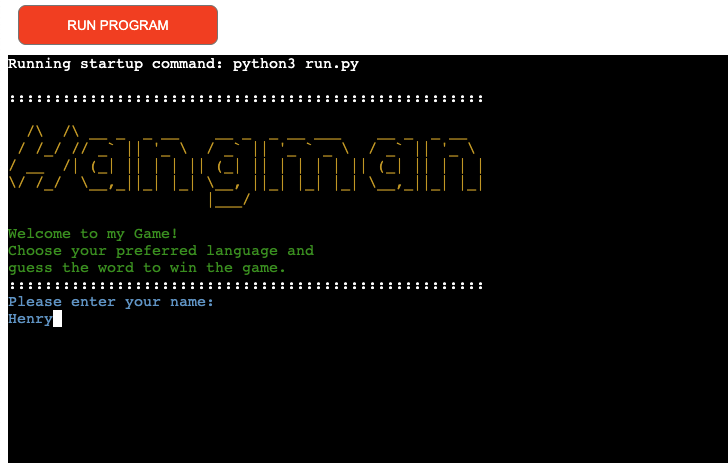

# Project Portfolio 3 Python - Hangman Game

Tradicionally hangman is a guessing game for two or more players. One player thinks of a word, phrase or sentence and the other(s) tries to guess it by suggesting letters within a certain number of guesses. Originally a Paper-and-pencil game, there are now electronic versions.
For more details about the origins of this game please click on the below link:

[Hangman - Wikipedia](https://en.wikipedia.org/wiki/Hangman_(game))

My version of the game allows to play one user at the time, I've implemented a menu that allows players to
chose the word in three different languages, there are a few functions that check the user validation
inputs for the game flow; in this version the player can only guess one letter at the time, if the word content two of the same letters, then they will be displayed on the screen, this increases the chances of winning, if after six attempts the player fails to guess the word, then it's game over.

The main goal of this project is to demonstrate my knowledge acquired throughout the course in Python. 
I hope you all like it and have fun playing.

## Live Site

[Hangman](https://pp3-hangman-game.herokuapp.com/)

# Contents

* [Objective](<#objective>)
* [User Experience](<#user-experience-ux>)
* [Hangman Flow Chart](<#hangman-flow-chart>)
* [Features](#features)
* [Future Features](<#future-features>)
* [Technologies Used](#technologies-used)
* [Testing](<#testing>)
  * [PEP8 Valdation](<#pep8-validation>)
  * [Bugs Fixed](#bugs-fixed)
  * [Terminal Compatibility](#terminal-compatibility>)
* [Deployment](#deployment)
* [Credits](<#credits>)
* [Acknowledgements](<#acknowledgements>)

# Objective

The aim of my project is to deliver a fun, intuitive, fully interactive, user friendly command line game. 

[Back to top](<#contents>)

# User Experience (UX)

## Visitors Goals

* A nice home page welcomes the player and invite to immediately engage with the game.
* The game offers the opportunity to the user, to put in practice their language and grammar skills.
* The game is intuitive and user friendly, steps and menus are well detailed along the game, making a very rewarding user experience.
* The game offers the user the option to go back to the main menu, check the rules of the game, select a new language, or to end it.

[Back to top](<#contents>)

# Hangman Flow Chart

A flow chart was created with the main purpose to map the steps to follow throughout the implementation process of this game, I signed up for a free account with [Lucid Chart](https://www.lucidchart.com/pages/) to be able to produce the below chart.

[Back to top](<#contents>)

# Features

My game displays the following features:

- Home Page
- Main Menu
- Instructions how to play hangman
- Language Selection
- Game Stages
- Exit Game

## Home Page

- The home page displays the name of game, welcomes the user and brifly explains how to play the game.
- Here the user will input his/her name to continue, once done the system will greet the player stating his/here name.

## Main Menu

- Once in the main menu, the player has three options:
  1. To read the game instructions
  2. To select the language before he/she start playing the game
  3. To exit the game if the player chages his/her mind

## Instructions how to play hangman

- The instructions are clear to follow, and have designed to cover all possible questions the user may have.

## Language Selection

-  Once selected, it offers the user to guess the words in the following languages:
   1. English
   2. Spanish
   3. French

## Game Stages

- Once the game begins, with each attemp the user will be able to see all the stages of the game:
  1. The selected letters
  2. The remaining attemps
  3. The letters that have been already used
  4. Error messages if the player makes the wrong selection
  5. The six stages of the hangman
  6. The option to play again or be redirected to the main menu

## Exit Game

- If selected, thanks the user for the visit; and offers instructions on how to restart the game again.

[Back to top](<#contents>)

# Future Features

## More languages

- This feature will definetely will make the game more interesting and fun to be played, unfurtunately due to time constraints I could not implement extra lists of words, in order to expand further the menu of the game.

## Timer

- This will definetely add a level of difficulty when the game is played.

Both above features will be taken into consideration for a future personal project.

[Back to top](<#contents>)

# Technologies Used

## Languages

- [Python](https://en.wikipedia.org/wiki/Python_(programming_language))

- [HTML5](https://en.wikipedia.org/wiki/HTML5)

- [CSS3](https://en.wikipedia.org/wiki/Cascading_Style_Sheets)

## Programs Used

- [Git](https://git-scm.com/) was used for version control by utilizing the Gitpod terminal to commit to Git and Push to GitHub and Heroku.

- [GitHub](https://github.com/) was used to store the projects code after being pushed from Git.

- [Heroku](https://heroku.com/) was used for the deployed application.

- [Lucid Chart](https://www.lucidchart.com/) to map the flowchart for the game.

- [PEP8 online](http://pep8online.com/checkresult) to find indentation errors in Python and solve it.

[Back to top](<#contents>)

# Testing

## PEP8 Validation

[PEP8](http://pep8online.com/) online validation was used to check that the code is up to standard. All pages cleared the PEP8 validation with no errors.

## run.py

## words.py

[Back to top](<#contents>)

# Bugs Fixed

- While testing the game I discovered I have an error with a function I created to clear the terminal, 

- I fixed this error by adding the correct external import statement > "import sys" to the run.py file.

- When I initially deplyed the game to Heroku, my game would't run due the following error: 

- I fixed this by adding the external downloaded colorama package to the requirements.txt file

[Back to top](<#contents>)

# Deployment

## Heroku

- The project was deployed using Code Institute's mock terminal for Heroku.

## Deployment steps

- Log into Heroku (create an account if you don't have one)
- Pick the 'Create new app' option from the dashboard.
- Enter your application name - this name has to be unique - select your region and then click 'Create App'
- This will bring you to your project page. From here, click the 'Settings' tab and scroll down to Config Vars.
- In the KEY input field, enter 'PORT' and in the VALUE input field, enter '8000'.
- Click the 'Add' button to the right to add the Convig Vars.
- On the same page scroll down to the buildpacks section and click 'Add Buildpack'
- Add both the Python and node.js buildpacks but make sure that the **Python buildpack is above the node.js one**
- Go back to the tabs at the top of the page and this time select the 'Deploy' tab.
- Select Github deployment method.
- Search for your repository name and click the 'Connect' button to link your chosen repository
- At the bottom of that page, select your preferred deplyment type; Automatic Deployment or Manual Deployment and wait a few minutes for your project to be deployed.

[Back to top](<#contents>)

# Credits

[Back to top](<#contents>)

# Acknowledgements

[Back to top](<#contents>)

